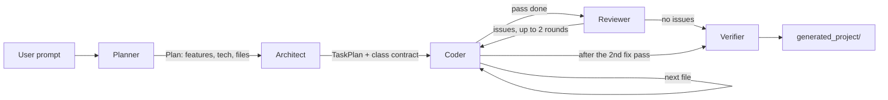

# Coder Buddy

Describe a web app in one sentence; get a working project on disk.

Coder Buddy is a multi-agent system built on [LangGraph](https://langchain-ai.github.io/langgraph/)
that turns a natural-language prompt into a small, runnable codebase. Three agents run in
sequence: a **planner** turns your prompt into a project spec, an **architect** breaks that spec
into ordered, dependency-aware file tasks, and a **coder** implements each task one file at a
time using read/write tools.

All models are served through [Groq](https://groq.com/).

## How it works



| Agent | Output | Defined in |
|---|---|---|
| Planner | `Plan` — name, description, features, technologies, file list | `agent/graph.py` |
| Architect | `TaskPlan` — ordered file tasks plus a shared class contract | `agent/graph.py` |
| Coder | Files written to `generated_project/` | `agent/graph.py` |
| Reviewer | `ReviewResult` — issues turned into fix tasks for the coder | `agent/graph.py`, `agent/review.py` |
| Verifier | Deterministic checks: missing files, unstyled classes, module scripts | `agent/verify.py` |

### Review loop

The coder writes one file per step, so it never sees how the files fit together. Once it
finishes, the **reviewer** reads the whole project and sends concrete fixes back — a page that
doesn't load a script it depends on, a script looking up an id the HTML lacks, a feature that
was asked for but never wired up. The coder applies them and the reviewer checks again:

```
coder → reviewer ─ no issues ──────────────────────────────→ verifier
                 └ issues → coder → reviewer ─ no issues ─→ verifier
                                             └ issues → coder → verifier
```

At most two reviews and two fix passes run (`MAX_REVIEW_ROUNDS`); the second fix pass is not
reviewed again, so a run always ends. The deterministic verifier still runs last.

Reviewing fits inside Groq's free tier of 8,000 tokens per minute, which rejects any single
request over the limit. Files are sent with comments stripped, in batches of about 6,000
characters, and every batch includes a one-line-per-file project index (what each page loads,
what each script defines and uses) so cross-file problems stay visible across batches. If a
review request fails, the run keeps the issues from the batches that did complete instead of
throwing away the finished project.

The coder is a ReAct agent with four sandboxed tools (`read_file`, `write_file`, `list_files`,
`get_current_directory`) defined in `agent/tools.py`. All file paths are confined to
`generated_project/`; attempts to escape it raise an error.

Each coder step is handed its context rather than going to find it: the shared class contract,
the list of every planned file in build order, a one-line-per-file index of what is already
written (what each page loads, which ids and classes it uses, what each script defines and uses
from other files), and the current content of its own file. It reads another file only when it
needs something the index can't give. Telling it to read every file instead made each step's
context grow with the project, until later steps exceeded Groq's per-minute token limit and
failed.

Every agent tries three Groq models in order, falling back to the next on failure:

| # | Model | Context | Max output |
|---|---|---|---|
| 1 | `openai/gpt-oss-120b` | 131K | 64K |
| 2 | `qwen/qwen3.8-27b` | 131K | 16K |
| 3 | `openai/gpt-oss-20b` | 131K | 64K |

The coder uses the same models in a different order (`CODER_MODEL_IDS`), since
it writes a whole file per call and needs output headroom.

The chain is defined once as `FALLBACK_MODEL_IDS` in `agent/graph.py`. Production models sit
at both the head and the tail deliberately: preview models can be retired at short notice, so
the chain stays functional even if the middle entry disappears. Groq publishes retirements at
[console.groq.com/docs/deprecations](https://console.groq.com/docs/deprecations) — worth a
glance if runs start failing.

`qwen/qwen3.6-27b` was removed: on the free tier it caps output at 1,000 tokens/minute and
refuses any request expecting more, which a stylesheet or a task plan exceeds on its own.
`qwen/qwen3.8-27b` has no such cap. Avoid `groq/compound` and `groq/compound-mini`: they
orchestrate their own built-in tools server-side and don't support the local tool-calling this
project relies on. `allam-2-7b` has only a 4K context.

Check what your account can actually reach with `client.models.list()` rather than the docs --
model availability differs per account.

The planner and architect go through `safe_invoke` in `agent/utils.py`, which additionally
retries a rate-limited model in place with exponential backoff before moving on. The coder
runs its own loop and only falls back across models. If all three fail on a step, the run
aborts rather than skipping the file.

## Requirements

- Python 3.11+
- A Groq API key — free at [console.groq.com/keys](https://console.groq.com/keys)

## Setup

```bash
git clone https://github.com/nakuluttarkar/coding_partner.git
cd coding_partner
```

Then install with [uv](https://docs.astral.sh/uv/) (recommended — uses the pinned `uv.lock`):

```bash
uv sync
```

Or with pip:

```bash
python -m venv .venv && source .venv/bin/activate  # Windows: .venv\Scripts\activate
pip install -r requirements.txt
```

Add your key:

```bash
cp .env.example .env
```

Then edit `.env` and set `GROQ_API_KEY=your_key_here`.

> **Note on versions:** langchain and langgraph have both shipped 1.x releases with breaking
> API changes. This project targets the 0.3.x / 0.6.x line, so both manifests carry upper
> bounds. Don't drop them without testing.

## Usage

**Web UI** (recommended):

```bash
streamlit run streamlit/app.py
```

Open http://localhost:8501, enter a prompt, and click *Generate Project*. Generated files are
listed in the page and can be downloaded as a ZIP.

**CLI:**

```bash
python main.py
```

You'll be prompted for a project description. Use `--recursion-limit / -r` to raise the cap on
coder iterations (default 100) for larger projects:

```bash
python main.py --recursion-limit 200
```

**Example prompts:**

- `Build a colourful modern todo app in html css and js`
- `Create a simple calculator web app using html, css, and javascript`
- `Make a landing page for a coffee shop with a contact form`

## Output

Everything is written to `generated_project/` in the repo root. This directory is gitignored
and **cleared at the start of every run**, so a project never ships with leftovers from the
previous one. Copy anything you want to keep before regenerating.

Two downloads are offered. The ZIP holds the real project — extract it fully before opening
`index.html`, since opening it from inside an archive viewer loads the page without its CSS or
JavaScript. The standalone HTML inlines the CSS and JavaScript into one file that works
anywhere, but only covers the entry page; links to other pages won't resolve.

## Development

Run inside the provided dev container (`.devcontainer/`) or a Codespace, and the Streamlit app
starts automatically on port 8501.

```
agent/
  graph.py     # LangGraph wiring + planner, architect, coder, reviewer, verifier
  prompts.py   # prompt templates
  review.py    # reviewer helpers: batching, project index, fix tasks
  states.py    # pydantic models for plan / task / coder / review state
  tools.py     # sandboxed file tools
  utils.py     # model fallback + retry
  verify.py    # deterministic post-generation checks
  bundle.py    # single-file HTML bundling for the standalone download
streamlit/
  app.py       # web UI
tests/         # pytest suite (no API key required)
main.py        # CLI entry point
```

### Tests

```bash
uv run pytest
```

The suite covers the model fallback/retry logic, the path sandbox, the coder loop, the
review loop (driven end to end through the compiled graph with stubbed models), the
verifier, and the bundler. It needs no Groq key: `tests/conftest.py` sets a dummy one so the client can
be constructed, and no test makes a real API call. CI runs it on every push and
pull request (`.github/workflows/ci.yml`).

## License

Not currently licensed. Add a `LICENSE` file before sharing or reusing this.
