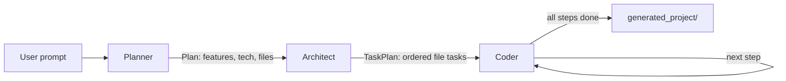

# Coder Buddy

Describe a web app in one sentence; get a working project on disk.

Coder Buddy is a multi-agent system built on [LangGraph](https://langchain-ai.github.io/langgraph/)
that turns a natural-language prompt into a small, runnable codebase. Three agents run in
sequence: a **planner** turns your prompt into a project spec, an **architect** breaks that spec
into ordered, dependency-aware file tasks, and a **coder** implements each task one file at a
time using read/write tools.

All models are served through [Groq](https://groq.com/).

## How it works



| Agent | Output | Defined in |
|---|---|---|
| Planner | `Plan` — name, description, features, technologies, file list | `agent/graph.py` |
| Architect | `TaskPlan` — ordered `ImplementationTask` list with integration details | `agent/graph.py` |
| Coder | Files written to `generated_project/` | `agent/graph.py` |

The coder is a ReAct agent with four sandboxed tools (`read_file`, `write_file`, `list_files`,
`get_current_directory`) defined in `agent/tools.py`. All file paths are confined to
`generated_project/`; attempts to escape it raise an error.

Every agent tries three Groq models in order, falling back to the next on failure:

1. `openai/gpt-oss-120b`
2. `openai/gpt-oss-20b`
3. `meta-llama/llama-4-scout-17b-16e-instruct`

The planner and architect go through `safe_invoke` in `agent/utils.py`, which additionally
retries a rate-limited model in place with exponential backoff before moving on. The coder
runs its own loop and only falls back across models. If all three fail on a step, the run
aborts rather than skipping the file.

## Requirements

- Python 3.11+
- A Groq API key — free at [console.groq.com/keys](https://console.groq.com/keys)

## Setup

```bash
git clone https://github.com/nakuluttarkar/coding_partner.git
cd coding_partner
```

Then install with [uv](https://docs.astral.sh/uv/) (recommended — uses the pinned `uv.lock`):

```bash
uv sync
```

Or with pip:

```bash
python -m venv .venv && source .venv/bin/activate  # Windows: .venv\Scripts\activate
pip install -r requirements.txt
```

Add your key:

```bash
cp .env.example .env
```

Then edit `.env` and set `GROQ_API_KEY=your_key_here`.

> **Note on versions:** langchain and langgraph have both shipped 1.x releases with breaking
> API changes. This project targets the 0.3.x / 0.6.x line, so both manifests carry upper
> bounds. Don't drop them without testing.

## Usage

**Web UI** (recommended):

```bash
streamlit run streamlit/app.py
```

Open http://localhost:8501, enter a prompt, and click *Generate Project*. Generated files are
listed in the page and can be downloaded as a ZIP.

**CLI:**

```bash
python main.py
```

You'll be prompted for a project description. Use `--recursion-limit / -r` to raise the cap on
coder iterations (default 100) for larger projects:

```bash
python main.py --recursion-limit 200
```

**Example prompts:**

- `Build a colourful modern todo app in html css and js`
- `Create a simple calculator web app using html, css, and javascript`
- `Make a landing page for a coffee shop with a contact form`

## Output

Everything is written to `generated_project/` in the repo root. This directory is gitignored.

Note that it is **not cleared between runs**: a new run overwrites files whose names collide
but leaves everything else in place, so output from a previous project can linger and end up
in your ZIP download. Delete the directory between unrelated prompts.

## Development

Run inside the provided dev container (`.devcontainer/`) or a Codespace, and the Streamlit app
starts automatically on port 8501.

```
agent/
  graph.py     # LangGraph wiring + the three agent nodes
  prompts.py   # prompt templates
  states.py    # pydantic models for plan / task / coder state
  tools.py     # sandboxed file tools
  utils.py     # model fallback + retry
streamlit/
  app.py       # web UI
main.py        # CLI entry point
```

## License

Not currently licensed. Add a `LICENSE` file before sharing or reusing this.
